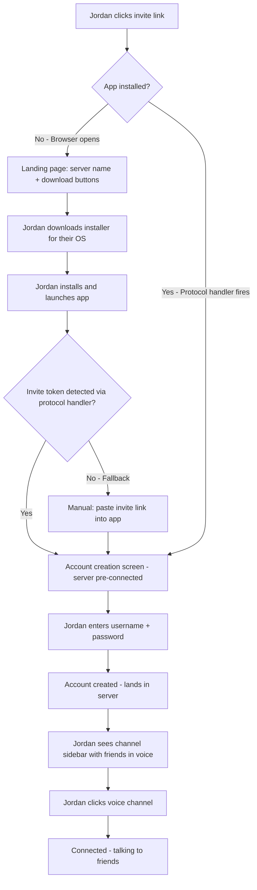
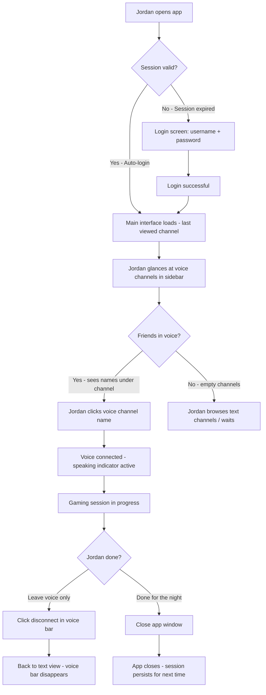
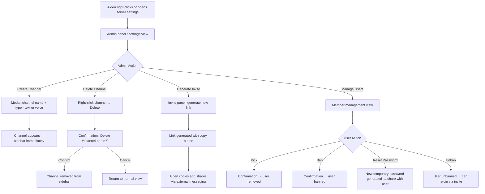

# UX Design Specification discord_clone

**Author:** Aidenwoodside
**Date:** 2026-02-24

---

## Executive Summary

### Project Vision

discord_clone is a privacy-first, self-hosted communication platform that replaces Discord for a closed friend group of ~20 users. Built as an Electron desktop app backed by a single AWS EC2 instance, it delivers voice channels, video calls, and persistent text chat — all end-to-end encrypted with zero logging and no telemetry. The emotional core of the project is ownership: the moment users realize "this is actually ours." The UX must feel instantly familiar to Discord users while being cleaner, faster, and free of corporate clutter.

### Target Users

**Aiden (Server Owner):** Privacy-motivated, technically capable. Deploys and manages the server, but day-to-day is just another user hanging out in voice channels. Needs admin tools that are powerful but invisible to regular users. Set-and-forget infrastructure.

**Jordan (Regular User):** Socially motivated, technically comfortable. Opens the app to hang out with friends — hopping in voice channels, bantering in text, gaming together. Expects a Discord-familiar experience with zero learning curve. Not privacy-driven, but appreciates that the platform is private and owned by a friend.

**Group culture:** Social-first, voice-centric. Users hang out in voice channels as a default state, with text channels serving as an ongoing side conversation. Coordination is informal — someone hops on, others follow. The app needs to feel like a living room you walk into, not a tool you launch.

### Key Design Challenges

- **Discord muscle memory:** Users have deeply ingrained spatial expectations from Discord. The layout (channel sidebar, message area, member list) must match closely enough that switching feels effortless, not like learning a new app.
- **Voice as the social heartbeat:** Voice channels are where the group lives. The app must make it immediately obvious who's in which channel at a glance — this is the primary social signal, not text activity.
- **Invisible admin experience:** Server owner admin tools (channel management, invites, kick/ban) must be powerful but unobtrusive, keeping the regular user experience clean and focused on hanging out.

### Design Opportunities

- **Simplicity as a feature:** By stripping away Discord's bloat (Nitro promos, server discovery, activities, shops), discord_clone can feel faster and cleaner than the platform it replaces. Less noise, more signal.
- **Intimate scale:** With ~20 users, every name in the member list is a real friend. The UX can lean into this warmth — no strangers, no bots, no spam. The app should feel like walking into your friend's basement, not joining a public server.
- **Frictionless onboarding:** Invite link to first voice call in under 5 minutes. No email verification, no CAPTCHA, no "customize your experience" wizards. Just click, create account, talk.

## Core User Experience

### Defining Experience

The core experience of discord_clone is **joining a voice channel and hanging out with friends.** Everything in the app exists to support this single interaction loop: open the app, see who's around, hop in, talk. Text channels are the persistent side conversation — always there, always flowing — but voice is where the group *lives*.

The defining quality of the experience is **effortless real-time communication.** Talking back and forth must feel as natural as being in the same room. There should be zero thought required to speak, hear, and know who's talking at any given moment.

### Platform Strategy

- **Electron desktop app** targeting Windows, macOS, and Linux from a single codebase
- **Mouse/keyboard primary** — this is a desktop-first experience used alongside games
- **Always-connected** — no offline mode; the app requires server connectivity
- **Lightweight footprint** — the app runs alongside games, so it must be resource-efficient and never compete for CPU/GPU/memory
- **Native audio integration** — leveraging WebRTC via Chromium for microphone and speaker access, with in-app device selection and hot-switching

### Effortless Interactions

- **Voice communication:** Speaking and hearing others must feel instant — no perceptible delay, no echo, no clipping. Users should never have to think about *how* to talk, only *what* to say.
- **Speaker identification:** It must be immediately obvious who is talking at any moment. Visual indicators (highlight, glow, or animation on the speaker's name/avatar) must be instant and unambiguous — even with 10+ people in a channel.
- **Channel joining:** One click to join a voice channel. One click to leave. No confirmation dialogs, no loading spinners that last more than a heartbeat.
- **App launch to voice:** Open app → see who's in voice → click channel → talking. This entire flow should take seconds, not minutes.
- **Text messaging:** Type, send, it appears instantly for everyone. No friction, no formatting modes, no composition complexity. Just plain text flowing like a conversation.

### Critical Success Moments

- **The first "can you hear me?":** When a new user joins voice for the first time and gets an instant response from friends — that's the moment the app earns trust. If this moment has lag, static, or confusion, the product fails.
- **The glance-and-join:** Opening the app and seeing friends already in a voice channel, then joining with one click. This is the daily ritual that makes the app sticky. It must feel like walking into a room, not booting up software.
- **The seamless session:** A 3-hour gaming session where nobody thinks about the app once. Voice just works. The app becomes invisible infrastructure — as unremarkable and reliable as electricity.
- **The "wait, this is ours?" moment:** When someone realizes there's no corporate middleman, no ads, no data harvesting. This is an emotional moment, not a UX moment — but the clean, bloat-free interface reinforces it.

### Experience Principles

1. **Voice is king.** Every design decision prioritizes the voice experience. If a feature competes with voice quality or clarity, voice wins.
2. **Invisible when it works.** The best UX is the one you don't notice. The app should disappear during a gaming session — no notifications fighting for attention, no UI getting in the way.
3. **Discord muscle memory, not Discord baggage.** Match the spatial layout and interaction patterns users already know, but strip away every piece of corporate bloat. Familiar but cleaner.
4. **One click, not two.** Minimize every interaction to the fewest possible steps. Join voice: one click. Send a message: type and enter. Switch channels: one click. No confirmations, no wizards, no extra screens.
5. **Show me who's here.** The social presence layer — who's online, who's in which voice channel, who's talking right now — is the lifeblood of the app. This information must be glanceable and always accurate.

## Desired Emotional Response

### Primary Emotional Goals

- **Comfortable familiarity:** The app should feel like a place users already know. Not exciting, not novel — just *right*. Like putting on a favorite hoodie. The emotional target is normalcy with a quiet undercurrent of pride in ownership.
- **Unbothered presence:** Users should never feel watched, marketed to, or managed. The emotional contrast with Discord is the absence of corporate friction — no promos, no upsells, no "we updated our privacy policy." Just friends, talking.
- **Quiet belonging:** Every interaction should reinforce "you're part of this crew." The app is a private clubhouse, and being inside it should feel like being in the right place with the right people.

### Emotional Journey Mapping

| Stage | Desired Emotion | Design Implication |
|-------|----------------|-------------------|
| **First open (onboarding)** | Instant recognition — "I already know how this works" | Discord-familiar layout, no tutorial needed, friends visible immediately |
| **Joining voice** | Relief and ease — "that was effortless" | One-click join, instant audio connection, familiar connect sound |
| **During a session** | Invisible comfort — the app disappears | No intrusive UI, no notifications fighting for attention, voice just works |
| **Something goes wrong** | Calm confidence — "it's fine, Aiden's on it" | Clear, honest error messages; automatic reconnection; no panic states |
| **Returning daily** | Warm routine — "let me check who's on" | Glanceable voice channel presence, fast app launch, immediate social signal |
| **Realizing it's self-hosted** | Quiet pride — "this is actually ours" | Clean, bloat-free UI silently reinforces ownership; no corporate branding or telemetry |

### Micro-Emotions

- **Belonging over Isolation:** The most critical emotional axis. The member list, voice channel presence, and real-time speaker indicators all exist to answer one question: "Are my people here?" This must always feel warm, never empty or lonely.
- **Confidence over Confusion:** Users must always know what to do next. Discord muscle memory handles most of this, but any discord_clone-specific flows (invite onboarding, admin tools) must be equally intuitive.
- **Trust over Skepticism:** Trust is the founding reason for this product. It's communicated not through badges or banners, but through the *absence* of dark patterns — no tracking, no data harvesting, no manipulative UI. Trust is felt, not announced.
- **Ease over Anxiety:** First-time users should feel welcomed, not overwhelmed. The onboarding flow (invite link → account creation → landing in the server) should feel like being walked to your seat, not dropped into a maze.

### Design Implications

- **Belonging → Social presence everywhere:** Voice channel member lists, online indicators, and speaking indicators must be prominent and always accurate. The app's primary visual story is "who's here right now."
- **Confidence → Familiar spatial layout:** Match Discord's three-column layout (channel sidebar, content area, member list). Users shouldn't have to learn anything new — their hands already know where to click.
- **Trust → Clean, honest UI:** No hidden settings, no data collection disclosures, no dark patterns. Error states are clear and human-readable. The app tells the truth, always.
- **Comfort → Warm, minimal aesthetics:** Dark theme by default (matching Discord convention and gaming culture). Clean typography, generous spacing, no visual clutter. The UI should feel like a calm, dark room — not a bright, noisy storefront.

### Emotional Design Principles

1. **Familiarity is the warmest welcome.** Don't make users learn — let them recognize. Every layout choice, every interaction pattern should trigger "I know this."
2. **Absence is a feature.** The things discord_clone *doesn't* have (ads, promos, telemetry banners, Nitro popups) are an active emotional signal. The clean silence says "we respect your attention."
3. **Human-scale failures.** When things break, the emotional response should be "I'll text Aiden" — not "I need to file a support ticket." Error messaging should be clear, calm, and honest.
4. **The living room test.** Every screen should pass the question: "Does this feel like walking into a friend's living room?" If it feels like a corporate lobby, strip it back.

## UX Pattern Analysis & Inspiration

### Inspiring Products Analysis

**Discord (the benchmark):**
Discord is both the inspiration and the cautionary tale. The core UX — channel sidebar, message area, member list in a three-column layout — is the gold standard for group communication apps. Key UX successes include: voice channel presence (seeing who's in which channel at a glance), real-time speaking indicators (green glow around the active speaker's avatar), one-click voice join/leave, and a channel list that's scannable in under a second. Discord's failure is scope creep: Nitro promos, server discovery, activities, shops, and constant monetization of attention have eroded the clean, focused experience that made it great. discord_clone should feel like Discord at its best — before the bloat.

**Steam (the companion):**
Steam demonstrates how a desktop app can coexist with games without competing for resources or attention. Its friends list is a masterclass in glanceable social presence: who's online, what they're playing, and how to reach them — all in a compact sidebar. The Steam overlay proves that a communication layer can exist *on top of* a game without being intrusive. Relevant lessons: lightweight resource footprint, background-friendly design, simple social presence indicators.

**Spotify (the invisible app):**
Spotify proves that a dark-themed desktop app can feel warm and inviting rather than cold and technical. Its UI is clean without feeling empty — generous spacing, clear typography, and consistent visual hierarchy. The persistent playback bar (always accessible regardless of navigation) is a pattern worth noting for discord_clone's voice connection status bar. Most importantly, Spotify demonstrates "invisible UX" — once music is playing, the app disappears from consciousness. This is exactly the emotional target for discord_clone during a gaming session.

### Transferable UX Patterns

**Navigation Patterns:**
- **Discord's channel sidebar:** A vertically scrollable list with clear section separation between text and voice channels. Voice channels show connected users nested beneath the channel name. This is the primary navigation pattern to replicate — users already have the muscle memory.
- **Steam's friends list compactness:** Social presence information (online/offline, current activity) communicated in minimal vertical space. Apply this to discord_clone's member list and voice channel participant display.

**Interaction Patterns:**
- **Discord's one-click voice join:** Click a voice channel name → immediately connected. No confirmation, no settings, no loading screen. This is the core interaction to preserve exactly.
- **Discord's speaking indicator:** A green glow/ring around the speaker's avatar or username that activates in real-time with voice activity. Instant, unambiguous, works even in peripheral vision. Critical to replicate faithfully.
- **Spotify's persistent status bar:** A bottom bar that always shows current state (now playing) regardless of navigation. Apply this to discord_clone's voice connection status — always show which voice channel you're in, with mute/deafen/disconnect controls accessible from any screen.

**Visual Patterns:**
- **Dark theme as default:** All three reference apps use dark themes. Gaming culture expects it. discord_clone should ship with a dark theme as the only theme — no light mode needed for this audience.
- **Spotify's warm dark palette:** Not pure black (#000) but a softer dark gray with subtle warmth. This prevents the "staring into the void" feeling and makes long sessions comfortable. Apply to discord_clone's background colors.
- **Discord's color-coded presence:** Green for online, gray for offline, yellow for idle. These are learned conventions — reuse them exactly.

### Anti-Patterns to Avoid

- **Discord's notification badge overload:** Red badges competing for attention on every channel, every server, every feature. discord_clone should use minimal notification indicators — this is a single server with 20 friends, not a network of communities demanding attention.
- **Discord's feature creep UI:** Nitro promos in the sidebar, server discovery buttons, activity launchers, shop links. Every pixel of discord_clone should serve communication. If it doesn't help you talk to friends, it doesn't belong.
- **Onboarding wizards and tutorials:** Discord now forces new users through server templates, customization flows, and "what brings you to Discord?" questionnaires. discord_clone's onboarding should be: invite link → create account → you're in. Zero wizards.
- **Modal dialogs for routine actions:** Confirmation dialogs for joining/leaving voice, "are you sure?" prompts for basic actions. These add friction to interactions that should be instant.
- **Aggressive notification permissions:** Don't pester users about enabling notifications on first launch. The app is for desktop gaming sessions — they're already looking at it.

### Design Inspiration Strategy

**What to Adopt (replicate faithfully):**
- Discord's three-column layout (channel sidebar, content area, member list)
- Discord's voice channel presence display (users nested under channel names)
- Discord's speaking indicator pattern (green glow on active speaker)
- Discord's one-click voice join/leave interaction
- Dark theme with warm gray palette (Spotify-inspired warmth)
- Color-coded presence indicators (green/gray/yellow — Discord convention)

**What to Adapt (modify for our context):**
- Discord's channel sidebar — simplified, no server list (single server only), no categories in MVP, no Nitro/shop/discovery clutter
- Steam's compact friends list — adapt for the member list panel, showing online status and current voice channel
- Spotify's persistent status bar — adapt as a voice connection bar at the bottom showing current channel, mute/deafen controls, and disconnect button

**What to Avoid (actively reject):**
- Any promotional or non-communication UI elements
- Notification badge overload — minimal, calm notification approach
- Onboarding wizards, tutorials, or "customize your experience" flows
- Confirmation dialogs for routine voice/text actions
- Feature-creep UI that serves the platform instead of the user

## Design System Foundation

### Design System Choice

**Tailwind CSS + Radix UI Primitives** — a utility-first styling framework paired with unstyled, accessible component primitives. This combination provides maximum visual flexibility with production-grade interactive behavior, optimized for a solo developer building a Discord-familiar interface.

### Rationale for Selection

- **Visual flexibility:** Tailwind's utility classes allow pixel-level control over the UI without fighting against an opinionated component library. This is critical for matching Discord's spatial layout and visual language — no overriding Material Design or Ant Design defaults.
- **Solo developer speed:** Tailwind eliminates context-switching between markup and stylesheets. Style-as-you-build workflow means faster iteration. Radix eliminates the need to hand-build complex interactive patterns (dropdowns, modals, context menus) from scratch.
- **Dark theme native:** Tailwind's built-in dark mode support (`dark:` variant) makes a dark-only theme trivial to implement and maintain.
- **Accessible by default:** Radix UI handles keyboard navigation, focus management, screen reader support, and ARIA attributes for complex interactive components. Accessibility is baked in, not bolted on.
- **No visual opinion:** Radix components are completely unstyled — they provide behavior (focus trapping, arrow key navigation, escape-to-close) without imposing any visual design. Full control over the look and feel remains with Tailwind.
- **Electron-compatible:** Both Tailwind and Radix work seamlessly in Electron's Chromium-based renderer with zero platform-specific issues.

### Implementation Approach

- **Tailwind CSS** as the sole styling solution — no additional CSS frameworks, no CSS-in-JS, no separate stylesheets. All styling via utility classes in component markup.
- **Radix UI** for complex interactive primitives: dropdown menus (channel settings, user actions), dialog/modal (admin confirmations, settings), tooltip (user info, button labels), context menu (right-click on messages/users), popover (invite link generation).
- **Custom components** for domain-specific UI: channel sidebar, voice channel participant list, speaking indicators, message feed, voice connection status bar. These are built directly with Tailwind — no library needed for layout components.
- **Design tokens** defined as Tailwind theme extensions in `tailwind.config.js` — colors, spacing, typography, and border radius values that match the Discord-familiar aesthetic.

### Customization Strategy

- **Color palette:** Define a custom dark palette in Tailwind config inspired by Discord's color scheme but with Spotify-influenced warmth. Primary background colors in the dark gray range (#1e1f22 to #2b2d31), accent colors for interactive elements, green for online/speaking indicators.
- **Typography:** System font stack for performance (no custom font loading). Discord uses gg sans; discord_clone will use a similar clean sans-serif system stack. Consistent size scale defined in Tailwind config.
- **Spacing and layout:** Tailwind's default spacing scale with custom additions for Discord-specific measurements (sidebar width, channel list item height, message padding).
- **Component patterns:** Establish reusable Tailwind class combinations for recurring patterns — channel list items, message bubbles, user presence indicators, voice participant cards. Document these as component-level patterns rather than abstracting into a formal design system library.

## Defining Core Experience

### Defining Experience

**"It's like Discord but it's actually ours."**

The defining experience of discord_clone is the moment a user clicks a voice channel, hears the connect sound, and starts talking to their friends — on a platform that belongs to them. It's Discord's core interaction loop (see channel → click → talk) delivered without the corporate overhead. The product doesn't need to teach users anything new. It needs to execute a familiar experience so cleanly that users forget they switched platforms — and then quietly remind them, through the absence of bloat, that this one is different.

If a user describes discord_clone to someone, they won't talk about encryption or self-hosting. They'll say: "It's like Discord but it's actually ours. Aiden built it and runs it on his own server. No ads, no tracking, just us."

### User Mental Model

**How users currently solve this problem:**
Discord. Every user in this group has years of Discord muscle memory. They know where channels are, how voice works, what the speaking indicator looks like, how to mute/deafen, where settings live. This mental model is the most important asset discord_clone has — and the most dangerous constraint.

**Mental model they bring:**
Users expect a three-column layout: channels on the left, content in the center, members on the right. They expect voice channels to show who's connected. They expect one click to join voice, one click to leave. They expect a text input at the bottom of a message feed. They expect green means online and a glowing border means someone is speaking. These aren't preferences — they're reflexes.

**Where they're likely to get confused:**
- If anything is in a different place than Discord puts it (channel list position, settings icon location, voice controls placement)
- If voice joining has any extra steps (confirmation dialog, settings prompt, permission request)
- If the onboarding flow asks them to do anything Discord doesn't (phone verification, server selection, profile customization)
- If admin features are visible to regular users — Discord hides admin controls behind role-based permissions, and users expect not to see things they can't use

**What they love about Discord:**
The instant voice join. The speaking indicators. The persistent text history. The channel sidebar scan. The fact that it "just works" — you open it, you're connected, you talk.

**What they hate about Discord:**
Nitro promos. Server discovery pushing public servers. "Activities" cluttering the UI. Privacy policy updates. Phone number requirements. The creeping feeling that every conversation is being harvested. The app getting slower and more bloated with every update.

### Success Criteria

The core experience succeeds when:

- **"I didn't notice the switch."** Users who move from Discord to discord_clone should feel no friction, no learning curve, no moment of "where is that button?" The transition should be invisible.
- **"Voice just works."** The first voice call connects instantly, audio is clear, speaking indicators are accurate, and no one has to troubleshoot anything. This is the single highest-stakes moment in the product.
- **"It's faster than Discord."** Because discord_clone has no bloat, no telemetry, no ad loading, no server discovery indexing — it should actually feel snappier than the app it's replacing. Users should notice this, even if subconsciously.
- **"I forgot it's not Discord."** During a 3-hour gaming session, no one should think about the app. It becomes invisible infrastructure. This is the ultimate success state.
- **"Wait, this is actually ours?"** The quiet emotional payoff. When a user realizes there's no corporate entity behind the app — just Aiden's server — it should feel like a pleasant surprise, not a limitation.

### Novel UX Patterns

**Pattern classification: Established patterns, zero novelty required.**

discord_clone does not need to innovate on interaction design. Its value proposition is executing proven patterns *better* (cleaner, faster, more private) — not inventing new ones. Every core interaction should be immediately recognizable to a Discord user:

| Interaction | Pattern Source | discord_clone Approach |
|-------------|---------------|----------------------|
| Channel navigation | Discord sidebar | Replicate exactly — text channels listed with # prefix, voice channels with speaker icon, connected users nested below |
| Voice join/leave | Discord one-click | Replicate exactly — click channel name to join, click disconnect to leave |
| Speaking indicator | Discord green glow | Replicate exactly — green ring/glow on active speaker's avatar or username |
| Text messaging | Discord message feed | Replicate exactly — chronological feed, author + timestamp + content, input bar at bottom |
| Mute/Deafen | Discord voice controls | Replicate exactly — mic and headphone icons in the voice status bar |
| User presence | Discord online/offline | Replicate exactly — green dot for online, gray for offline |

**The unique twist is subtraction, not addition.** The innovation is in what's *removed*: no Nitro promos, no server discovery, no activities, no shops, no telemetry banners, no phone verification. The novelty is the clean silence.

### Experience Mechanics

**Core Interaction: Join Voice Channel and Talk**

**1. Initiation:**
- User opens the app → lands on the last-viewed text channel with the channel sidebar visible
- User glances at voice channels in the sidebar → sees friend names nested under "Gaming" voice channel
- This visual cue ("my friends are already here") is the trigger to join

**2. Interaction:**
- User clicks the voice channel name → immediate connection (target: under 3 seconds)
- A subtle connect sound plays (familiar Discord-style audio cue)
- User's name appears in the voice channel participant list for all connected users
- The voice connection status bar appears at the bottom of the app showing: channel name, mute button, deafen button, video toggle, disconnect button

**3. Feedback:**
- **Speaking indicators:** Green glow around the avatar/username of whoever is currently speaking — updates in real-time with zero perceptible delay
- **Self-monitoring:** User's own speaking indicator glows when they talk, confirming their mic is working
- **Participant count:** Voice channel in sidebar shows updated participant count and names
- **Audio quality:** Clear, low-latency audio confirms the connection is solid

**4. Completion:**
- User clicks disconnect button in the voice status bar → immediately leaves the channel
- A subtle disconnect sound plays
- User's name is removed from the voice channel participant list for all users
- Voice status bar disappears, returning to the standard text channel view
- No confirmation dialog, no "are you sure?" — just instant disconnect

## Visual Design Foundation

### Color System

**Philosophy:** Discord-familiar with Spotify-inspired warmth. The palette should feel like a place you already know, but subtly warmer and cleaner — less corporate, more personal.

**Background Colors (Dark Palette):**

| Token | Hex | Usage |
|-------|-----|-------|
| `bg-primary` | `#1e1f22` | Main content area background (message feed, center column) |
| `bg-secondary` | `#2b2d31` | Channel sidebar background, member list background |
| `bg-tertiary` | `#232428` | Input fields, embedded content, code blocks |
| `bg-floating` | `#111214` | Popover menus, dropdowns, tooltips, modals |
| `bg-hover` | `#35373c` | Hover state for interactive list items (channels, members) |
| `bg-active` | `#404249` | Active/selected state for channels, pressed buttons |
| `bg-voice` | `#2a2d2e` | Voice channel connected state background |

**Text Colors:**

| Token | Hex | Usage |
|-------|-----|-------|
| `text-primary` | `#f2f3f5` | Primary text — messages, headings, usernames |
| `text-secondary` | `#b5bac1` | Secondary text — timestamps, labels, descriptions |
| `text-muted` | `#6d6f78` | Muted text — placeholders, disabled states, hints |
| `text-link` | `#00a8fc` | Clickable links in messages |

**Accent & Semantic Colors:**

| Token | Hex | Usage |
|-------|-----|-------|
| `accent-primary` | `#5865f2` | Primary action buttons, selected indicators (Discord's blurple — familiar) |
| `accent-hover` | `#4752c4` | Hover state on primary accent |
| `status-online` | `#23a55a` | Online presence dot, speaking indicator glow |
| `status-idle` | `#f0b232` | Idle/away presence indicator |
| `status-dnd` | `#f23f43` | Do not disturb indicator (future use) |
| `status-offline` | `#80848e` | Offline presence dot |
| `success` | `#23a55a` | Success states, connected confirmations |
| `warning` | `#f0b232` | Warning states, connection issues |
| `error` | `#f23f43` | Error states, disconnections, failed actions |
| `voice-speaking` | `#23a55a` | Speaking indicator ring/glow — must be high-contrast against dark backgrounds |

**Contrast Compliance:**
- `text-primary` on `bg-primary`: 14.5:1 (exceeds WCAG AAA)
- `text-secondary` on `bg-primary`: 8.2:1 (exceeds WCAG AAA)
- `text-muted` on `bg-primary`: 3.8:1 (meets WCAG AA for large text)
- `voice-speaking` on `bg-secondary`: 5.1:1 (meets WCAG AA — critical for speaking indicator visibility)

### Typography System

**Philosophy:** Clean, fast, invisible. Typography should never draw attention to itself — it should deliver content and get out of the way. System fonts for zero loading latency.

**Font Stack:**
```
font-family: -apple-system, BlinkMacSystemFont, "Segoe UI", "Noto Sans", Helvetica, Arial, sans-serif;
```

No custom web fonts — system fonts load instantly, feel native on each OS, and eliminate a network request. This aligns with the "lightweight footprint" principle.

**Type Scale:**

| Token | Size | Weight | Line Height | Usage |
|-------|------|--------|-------------|-------|
| `text-xs` | 12px | 400 | 16px | Timestamps, channel descriptions, meta text |
| `text-sm` | 14px | 400 | 18px | Channel names, member names in sidebar, secondary labels |
| `text-base` | 16px | 400 | 22px | Message body text — primary reading size |
| `text-lg` | 18px | 600 | 24px | Section headers within settings, modal titles |
| `text-xl` | 20px | 700 | 26px | Server name header, major section titles |
| `text-username` | 16px | 500 | 20px | Username in message feed — slightly bolder than body for scanability |

**Key Decisions:**
- **16px base** for message text — large enough for comfortable reading during long sessions, matching Discord's approach
- **Semibold (600) for usernames** in the message feed — users need to quickly scan who said what
- **12px for timestamps** — visible when needed, invisible when scanning
- **No italic or decorative styles** in the core UI — clean, direct, utilitarian

### Spacing & Layout Foundation

**Philosophy:** Dense enough to show information at a glance, spacious enough to breathe. Match Discord's density — users expect a certain amount of information per viewport.

**Base Unit:** 4px grid system. All spacing values are multiples of 4px.

**Spacing Scale:**

| Token | Value | Usage |
|-------|-------|-------|
| `space-1` | 4px | Tight spacing — between icon and label, between status dot and username |
| `space-2` | 8px | Default internal padding — inside buttons, list items |
| `space-3` | 12px | Gap between message groups, section separation |
| `space-4` | 16px | Panel padding, major section margins |
| `space-5` | 20px | Large section separation |
| `space-6` | 24px | Major layout gaps |

**Layout Structure (Three-Column):**

| Region | Width | Behavior |
|--------|-------|----------|
| Channel Sidebar | 240px fixed | Scrollable channel list, server name header, voice status bar at bottom |
| Content Area | Flexible (fill remaining) | Message feed or voice channel view, text input at bottom |
| Member List | 240px fixed | Online/offline member list, collapsible |

**Component Spacing Patterns:**

- **Channel list item:** 32px height, 8px horizontal padding, 4px gap between icon and name
- **Message in feed:** 16px horizontal padding, 4px vertical padding between messages from same author, 16px gap between message groups (different authors)
- **Voice channel participant:** 32px height, nested 24px left indent under channel name, 8px gap between avatar and username
- **Voice status bar:** 52px height, fixed to bottom of sidebar, 12px internal padding
- **Text input bar:** 44px minimum height, 16px horizontal padding, 12px from bottom of content area

### Accessibility Considerations

**Color Accessibility:**
- All text meets WCAG AA minimum contrast ratios against their intended backgrounds
- Speaking indicator (`#23a55a`) meets AA contrast against dark sidebar — critical for the core voice experience
- Error/warning colors are never used as the sole indicator — always paired with text or icons
- No color-only state communication — online/offline/speaking always have shape or animation cues in addition to color

**Interaction Accessibility:**
- All interactive elements have visible focus rings (2px solid `accent-primary`) for keyboard navigation
- Minimum touch/click target size of 32px for all interactive elements
- Radix UI primitives provide ARIA attributes, keyboard navigation, and screen reader support out of the box
- Voice controls (mute, deafen, disconnect) are large enough to hit quickly during gameplay — minimum 36px click targets

**Motion & Animation:**
- Speaking indicator glow uses a subtle pulse/ring animation — not a harsh flash
- Channel transitions are instant (no page-transition animations that slow down navigation)
- Hover states use 150ms ease transition — fast enough to feel responsive, smooth enough not to flicker
- No auto-playing animations or motion that could be distracting during gaming sessions
- Respect `prefers-reduced-motion` media query — disable speaking pulse animation, use static highlight instead

## Design Direction Decision

### Design Directions Explored

Six design directions were generated and evaluated as interactive HTML mockups (`ux-design-directions.html`), each applying the established three-column Discord layout with different visual treatments:

- **A: Classic Discord** — Pixel-close to Discord's current visual language. Maximum familiarity, zero personality.
- **B: Warm & Earthy** — Brown/amber tones, softer border radius, warmer text colors. Cozy and personal.
- **C: Minimal & Clean** — Ultra-dark with left-border indicators. IDE-like efficiency, maximum quiet.
- **D: Vibrant Gaming** — Deep indigo/purple undertones with energetic accent usage. Gaming-forward.
- **E: Subtle Warmth** — Discord's layout with softer edges and warmer hover states. Refined familiar.
- **F: Deep Dark** — Near-black backgrounds, minimal contrast. Maximum stealth.

### Chosen Direction

**Direction B: Warm & Earthy**

The warm, earthy direction was selected for its distinct personality and emotional resonance with the project's core identity. While other directions prioritized familiarity through mimicry, Direction B achieves familiarity through *layout* while establishing a unique visual identity through *color and texture*.

### Design Rationale

- **Ownership through identity:** The warm palette immediately signals "this isn't Discord." It reinforces the emotional core of the project — "this is actually ours" — by looking and feeling like something built with intention, not cloned from a corporate product.
- **Cozy over corporate:** The brown/amber tones evoke warmth, comfort, and intimacy — aligned with the "friend's living room" emotional target. Cool grays feel like offices; warm tones feel like home.
- **Layout familiarity preserved:** The three-column layout, channel sidebar structure, voice channel nesting, and all spatial patterns remain Discord-identical. Muscle memory is preserved through layout, not color.
- **Visual distinction aids adoption:** When friends first open the app, the warm palette creates an immediate "this is something new and cool" reaction rather than "this is a knockoff Discord." Distinction builds pride in the platform.
- **Softer border radius (8px):** The rounder corners feel friendlier and more approachable than Discord's sharper 4px corners, reinforcing the warm, human-scale aesthetic.

### Implementation Approach

**Updated Color Palette (replacing Visual Foundation defaults):**

| Token | Hex | Usage |
|-------|-----|-------|
| `bg-primary` | `#221e1a` | Main content area background |
| `bg-secondary` | `#2a2520` | Channel sidebar, member list |
| `bg-tertiary` | `#1c1915` | Input fields, embedded content |
| `bg-floating` | `#161310` | Popovers, dropdowns, tooltips, modals |
| `bg-hover` | `#362f28` | Hover state for interactive items |
| `bg-active` | `#3d342b` | Active/selected state |
| `text-primary` | `#f0e6d9` | Primary text |
| `text-secondary` | `#a89882` | Secondary text, timestamps |
| `text-muted` | `#6d5f4e` | Placeholders, disabled states |
| `accent-primary` | `#c97b35` | Primary accent — warm amber replacing blurple |
| `accent-hover` | `#b56a28` | Hover state on primary accent |

**Semantic colors remain unchanged:** `status-online` (#23a55a), `status-idle` (#f0b232), `error` (#f23f43) — these are universal conventions that should stay consistent regardless of theme.

**Border Radius:** Default 8px for interactive elements (channels, members, buttons, inputs). 12px for the message input bar. Avatars remain fully round.

**Tailwind Config Approach:** All warm palette values defined as custom colors in `tailwind.config.js`, replacing the default cool gray tokens established in the Visual Foundation. The implementation uses the same token naming — only the hex values change.

## User Journey Flows

### Journey 1: First-Time Onboarding (Jordan Joins)

**Entry Point:** Jordan receives an invite URL from Aiden (via text, Discord, or any messaging app)

**Flow Goal:** Invite link to first voice call in under 5 minutes with zero hand-holding



**Screen-by-Screen Breakdown:**

**Screen 1: Landing Page (browser)**
- Dark warm background matching app aesthetic
- Server name displayed prominently ("Aiden's Server")
- "You've been invited to join" message
- Three download buttons: Windows (.exe), macOS (.dmg), Linux (.AppImage)
- Minimal — no navigation, no footer, no distractions
- Invite token encoded in URL, passed to app via `discord-clone://invite/TOKEN` protocol

**Screen 2: Account Creation (app)**
- Server connection pre-filled from invite token (shows server name, not raw address)
- Two fields only: Username, Password
- Single "Create Account" button
- No email, no phone, no CAPTCHA, no "customize your experience"
- On success: immediate redirect into the server

**Screen 3: First View (app — main interface)**
- Three-column layout loads with default text channel selected (#general)
- Channel sidebar shows text and voice channels
- Voice channels show connected users nested underneath
- Jordan sees friends already in a voice channel — this is the trigger to join
- No tutorial overlay, no welcome wizard, no "click here to get started" tooltip

**Error States:**
- Invalid/expired invite link → Landing page shows "This invite is no longer valid. Ask the server owner for a new one."
- Server unreachable during account creation → "Can't reach the server right now. Try again in a moment."
- Username already taken → Inline error below username field: "That username is taken. Try another."

### Journey 2: Daily Session (Jordan's Routine)

**Entry Point:** Jordan opens the discord_clone app from desktop/taskbar

**Flow Goal:** App open to talking in voice in under 10 seconds



**Key Interaction Details:**

**App Launch:**
- Persistent session — no login required on restart (token stored securely)
- App loads to last-viewed text channel with sidebar visible
- Voice channel presence updates immediately on load (who's in which channel)
- Target: app launch to usable interface in under 5 seconds

**Voice Join:**
- Single click on voice channel name → connected
- Connect sound plays (subtle audio cue confirming connection)
- Voice status bar appears at bottom of sidebar: channel name, mute, deafen, video toggle, disconnect
- User's name appears under voice channel in sidebar for all other users
- Speaking indicator activates immediately when user talks

**During Session:**
- User can browse text channels while in voice (voice persists across channel navigation)
- Speaking indicators update in real-time in the voice channel participant list
- Mute/deafen toggleable from the voice status bar at any time
- Video toggle available in voice status bar

**Voice Leave:**
- Click disconnect button in voice status bar → immediately disconnected
- Disconnect sound plays
- Voice status bar disappears
- User's name removed from voice channel participant list

### Journey 3: Server Administration (Aiden Manages)

**Entry Point:** Aiden is already logged in and using the app normally

**Flow Goal:** Admin actions accessible quickly without cluttering the regular user experience



**Admin Access Pattern:**
- Server name in sidebar header has a dropdown chevron (▼) — click to access server settings
- Right-click context menus on channels and members for quick actions
- Admin-only options are simply not rendered for regular users — no "you don't have permission" messages, just absence
- All destructive actions (delete channel, kick, ban) require a single confirmation dialog
- Non-destructive actions (create channel, generate invite, reset password) do not require confirmation

**Channel Management:**
- Create: Modal with channel name input + text/voice toggle. Channel appears in sidebar immediately after creation.
- Delete: Right-click channel → "Delete Channel" → confirmation → removed. Messages in deleted text channels are permanently lost (warn in confirmation).

**Invite Management:**
- Accessible from server settings dropdown
- "Generate Invite Link" button creates a new link
- Copy-to-clipboard button for easy sharing
- List of active invite links with revoke option
- No expiration by default (owner can revoke manually)

**User Management:**
- Accessible from server settings or right-click on member in member list
- Kick: Removes user from server, they can rejoin via new invite
- Ban: Removes user and prevents rejoining (blocks account + potential new accounts)
- Unban: Allows a previously banned user to rejoin
- Reset Password: Generates a temporary password the owner shares with the user directly

### Journey Patterns

**Navigation Patterns:**
- **Sidebar-first navigation:** All primary navigation happens in the channel sidebar. Users never leave the three-column layout for core actions.
- **Context menus for power actions:** Right-click on channels, members, and messages for secondary actions. Keeps the primary UI clean.
- **Voice persists across navigation:** Joining voice in one channel, then clicking a text channel doesn't disconnect voice. Voice is a persistent layer, not a page.

**Feedback Patterns:**
- **Audio cues for voice state changes:** Connect sound, disconnect sound, mute/unmute confirmation. Users get auditory feedback without needing to look at the screen.
- **Instant visual updates:** Channel join/leave, speaking indicators, presence changes — all update in real-time with zero perceived delay.
- **Inline errors over modals:** Error messages appear inline near the action that caused them, not as disruptive modal dialogs.

**Decision Patterns:**
- **Confirmations only for destructive actions:** Delete channel, kick user, ban user. Everything else (join voice, send message, create channel) is instant with no confirmation.
- **Undo over confirmation where possible:** If a non-destructive action can be undone, skip the confirmation and offer undo instead.

### Flow Optimization Principles

1. **Minimize clicks to voice.** The core loop (open app → join voice → talk) must be achievable in 2 interactions: launch app, click channel. No login (persistent session), no intermediate screens.
2. **Zero-configuration onboarding.** The invite link carries all connection information. The user provides only username and password. No server address, no settings, no profile setup.
3. **Admin tools are hidden, not gated.** Regular users don't see admin options at all — not greyed out, not "you need permission," just absent. This keeps the UI clean and avoids confusion.
4. **Voice is a layer, not a destination.** Users can be in voice and browse text channels simultaneously. Voice state persists across all navigation. The voice status bar is always visible when connected.
5. **Errors are calm and actionable.** Every error message tells the user what happened and what to do next. No error codes, no technical jargon, no panic.

## Component Strategy

### Design System Components

**From Radix UI (behavior primitives — we style with Tailwind):**

| Radix Primitive | discord_clone Usage |
|----------------|-------------------|
| `DropdownMenu` | Server settings dropdown (chevron in sidebar header), channel context menus |
| `Dialog` | Channel creation modal, delete confirmations, admin password reset |
| `Tooltip` | Button labels (mute, deafen, disconnect, settings), member info on hover |
| `ContextMenu` | Right-click on channels (delete, edit), right-click on members (kick, ban, reset password) |
| `Popover` | Invite link generation panel, user profile quick view |
| `ScrollArea` | Channel list scrolling, message feed scrolling, member list scrolling |
| `Separator` | Visual dividers between channel sections (text vs. voice) |
| `Toggle` | Mute/deafen toggle buttons in voice status bar |

**From Tailwind CSS (styling foundation):**

All visual styling handled via Tailwind utility classes using the warm earthy color tokens defined in `tailwind.config.js`. No additional CSS library needed. Tailwind provides the spacing scale, typography scale, color system, border radius, transitions, and responsive utilities.

### Custom Components

#### ChannelSidebar

**Purpose:** Primary navigation panel — the left column containing server header, channel lists, voice status bar, and user panel.

**Anatomy:**
- Server header (top): Server name + dropdown chevron (admin: settings access)
- Text channel section: Label + list of text channel items
- Voice channel section: Label + list of voice channel items with nested participant lists
- Voice status bar (bottom, conditional): Shown only when connected to voice
- User panel (bottom): Current user avatar, name, status, settings button

**States:**
- Default: Full channel list visible, scrollable if overflow
- Voice connected: Voice status bar appears above user panel
- Admin view: Dropdown chevron on server header reveals admin options

**Key Behaviors:**
- Fixed 240px width, full viewport height
- Channel list scrolls independently
- Voice status bar and user panel are fixed to bottom, never scroll

#### ChannelItem

**Purpose:** Individual clickable item in the channel sidebar representing a text or voice channel.

**Anatomy:**
- Channel icon (# for text, speaker icon for voice)
- Channel name
- Unread indicator (subtle dot, not aggressive badge)

**States:**
- Default: `text-secondary` color, no background
- Hover: `bg-hover` background, `text-primary` color
- Active/Selected: `bg-active` background, `text-primary` color
- Unread: Channel name in `text-primary` (bolder) with small dot indicator

**Variants:**
- Text channel: # icon prefix
- Voice channel: Speaker icon prefix, expandable to show participants

#### VoiceParticipant

**Purpose:** Shows a user connected to a voice channel, nested under the voice channel item in the sidebar.

**Anatomy:**
- Avatar circle (24px, user initial, colored background)
- Username
- Speaking indicator (green ring around avatar)
- Mute/deafen icon (if user is muted/deafened)

**States:**
- Default: Avatar + name, no ring
- Speaking: Green ring (`status-online`) animates around avatar — subtle pulse, not flash
- Muted: Small mute icon overlay on avatar
- Deafened: Small headphone-off icon overlay on avatar

**Key Behaviors:**
- 32px row height, 24px left indent under channel name
- Speaking indicator updates in real-time via voice activity detection
- Respects `prefers-reduced-motion`: static green ring instead of pulse

#### VoiceStatusBar

**Purpose:** Persistent control bar shown when the user is connected to a voice channel. Fixed to bottom of sidebar.

**Anatomy:**
- Connection status label ("Voice Connected" in green)
- Channel name
- Mute toggle button
- Deafen toggle button
- Video toggle button
- Disconnect button (red accent)

**States:**
- Connected: Green label, all controls active
- Muted: Mute button highlighted/crossed, audio input stopped
- Deafened: Deafen button highlighted/crossed, all audio stopped
- Video on: Video button highlighted, camera active

**Key Behaviors:**
- 52px height, fixed to bottom of sidebar (above user panel)
- Only visible when connected to a voice channel
- Appears with subtle slide-up animation on connect
- Disappears immediately on disconnect
- Controls have 36px minimum click targets for quick gameplay access

#### UserPanel

**Purpose:** Shows current user info and quick settings access. Fixed to very bottom of sidebar.

**Anatomy:**
- User avatar (32px, initial, colored background)
- Username
- Online status text
- Settings gear button

**States:**
- Default: Avatar + name + status + settings button
- Hover on settings: Button highlights

**Key Behaviors:**
- Always visible at bottom of sidebar, below voice status bar
- Settings button opens user settings view (audio device selection, account settings)

#### MessageFeed

**Purpose:** Scrollable chronological list of messages in a text channel. Center column content.

**Anatomy:**
- Content header (channel name with # prefix)
- Message list (scrollable)
- Text input bar (fixed to bottom)

**Key Behaviors:**
- Auto-scrolls to newest message on load and when new messages arrive (if already at bottom)
- If user has scrolled up, new messages don't auto-scroll — show "New messages" indicator instead
- Messages grouped by author: consecutive messages from same author share a single header (avatar + name + timestamp)

#### MessageGroup

**Purpose:** A group of messages from the same author in sequence.

**Anatomy:**
- Message header: Author avatar (32px) + username (semibold) + timestamp (muted, 12px)
- Message body/bodies: One or more message text blocks below the header

**States:**
- Default: Standard display
- Hover: Subtle background highlight on the entire group area

**Key Behaviors:**
- Messages from the same author within 5 minutes share a single header
- New author or >5 minute gap starts a new message group
- 16px gap between message groups, 4px gap between messages within a group

#### MessageInput

**Purpose:** Text input bar for composing and sending messages in a text channel.

**Anatomy:**
- Text input field (full width, rounded 12px)
- Placeholder text: "Message #channel-name"

**States:**
- Default: Empty with placeholder
- Active/Focused: Subtle border highlight or ring
- Typing: User text visible

**Key Behaviors:**
- Enter to send, Shift+Enter for newline
- Input clears immediately on send
- No rich text toolbar, no formatting buttons — plain text only (MVP)
- 44px minimum height, expands with multi-line content

#### MemberList

**Purpose:** Right column showing online/offline members of the server.

**Anatomy:**
- Section headers: "ONLINE — {count}" and "OFFLINE — {count}"
- Member items listed under each section

**Key Behaviors:**
- Fixed 240px width
- Online members listed first, offline members below (dimmed)
- Collapsible — can be toggled to give more space to content area

#### MemberItem

**Purpose:** Individual member entry in the member list.

**Anatomy:**
- Avatar (32px, initial, colored background)
- Status dot (10px, positioned bottom-right of avatar)
- Username

**States:**
- Online: Full opacity, green status dot
- Offline: Reduced opacity (0.5), gray status dot
- Hover: `bg-hover` background highlight

**Key Behaviors:**
- Click: Shows user profile popover (future: DMs)
- Right-click (admin only): Context menu with kick/ban/reset password options
- 6px border radius on hover highlight

#### ConnectionError

**Purpose:** Overlay or banner shown when the app cannot reach the server.

**Anatomy:**
- Warning icon
- Message: "Can't connect to server. Trying to reconnect..."
- Subtle pulsing animation indicating active retry

**States:**
- Reconnecting: Animated indicator + "Trying to reconnect..." message
- Failed: Static message + "Check your connection or contact the server owner"
- Reconnected: Brief green "Connected" flash, then disappears

**Key Behaviors:**
- Appears as a banner at the top of the content area, not a modal (doesn't block interaction with cached content)
- Auto-retries connection on an exponential backoff
- Disappears automatically on successful reconnection

#### InviteLandingPage

**Purpose:** Web page served at the invite URL for users who don't have the app installed.

**Anatomy:**
- Server name prominently displayed
- "You've been invited to join" message
- Download buttons: Windows, macOS, Linux
- Warm earthy dark background matching app aesthetic

**States:**
- Valid invite: Shows server name + download buttons
- Invalid/expired invite: "This invite is no longer valid. Ask the server owner for a new one."
- Server unreachable: "Server is currently offline. Try again later."

#### AccountCreation

**Purpose:** In-app screen shown when a user opens the app via an invite link for the first time.

**Anatomy:**
- Server name display (pre-filled from invite token)
- Username input field
- Password input field
- "Create Account" button

**States:**
- Default: Empty fields, button disabled until both fields have content
- Submitting: Button shows loading state
- Error: Inline error messages below relevant field (username taken, password too short, server unreachable)
- Success: Immediate redirect to main interface

### Component Implementation Strategy

**Build Order Priority (aligned with user journeys):**

**Phase 1 — Core Loop (Journey 2: Daily Session):**
These components must exist for the app to function at all.
1. `ChannelSidebar` + `ChannelItem` — primary navigation
2. `MessageFeed` + `MessageGroup` + `MessageInput` — text communication
3. `VoiceParticipant` + `VoiceStatusBar` — voice experience
4. `MemberList` + `MemberItem` — social presence
5. `UserPanel` — current user identity and settings access
6. `ConnectionError` — graceful failure handling

**Phase 2 — Onboarding (Journey 1: First-Time):**
These enable new users to join.
7. `InviteLandingPage` — web download page
8. `AccountCreation` — in-app registration
9. Login screen (simple: two fields + button, doesn't need a custom component spec)

**Phase 3 — Administration (Journey 3: Admin):**
These enable Aiden to manage the server.
10. Server settings dropdown (Radix `DropdownMenu`)
11. Channel creation modal (Radix `Dialog`)
12. Invite management panel (Radix `Popover`)
13. User management context menus (Radix `ContextMenu`)
14. Confirmation dialogs for destructive actions (Radix `Dialog`)

### Implementation Roadmap

**All components use:**
- Tailwind CSS for styling (warm earthy tokens from `tailwind.config.js`)
- Radix UI primitives for interactive behavior where applicable
- 8px default border radius, 12px for inputs
- System font stack
- 4px spacing grid

**Component development approach:**
- Build components in isolation first (consider Storybook or similar for visual testing)
- Start with static layout, then add interactivity
- Voice-related components (`VoiceParticipant`, `VoiceStatusBar`) depend on WebRTC integration — build the visual shell first, wire up real-time data later
- `MessageFeed` needs WebSocket integration for real-time updates — again, build visual shell first
- Admin components (Phase 3) can use the same Radix primitives as the rest of the app — no special framework needed

## UX Consistency Patterns

### Button Hierarchy

**Primary Action Button:**
- Warm amber fill (`accent-primary` / `#c97b35`), white text
- Used for: "Create Account," "Create Channel," "Generate Invite Link"
- Only one primary button per view — the single most important action
- 8px border radius, 36px minimum height, 16px horizontal padding
- Hover: `accent-hover` / `#b56a28`
- Disabled: 50% opacity, no pointer cursor

**Secondary Action Button:**
- Transparent background, `text-secondary` border, `text-secondary` text
- Used for: "Cancel" in modals, "Copy Link," settings toggles
- Hover: `bg-hover` background
- Same sizing as primary

**Danger Button:**
- `error` fill (`#f23f43`), white text
- Used exclusively for destructive actions: "Delete Channel," "Ban User," "Kick User"
- Only appears inside confirmation dialogs — never as a primary page action
- Hover: darkened error color

**Icon Buttons:**
- No background, icon only, `text-muted` color
- Used for: Voice controls (mute, deafen, video, disconnect), settings gear, close buttons
- 32-36px click target (larger for voice controls)
- Hover: `bg-hover` background circle/rounded square
- Active/toggled: `accent-primary` color or crossed-out icon for mute/deafen

**Button Rules:**
- No button outlines or shadows — flat design consistent with warm earthy aesthetic
- All buttons have visible focus rings (2px `accent-primary`) for keyboard navigation
- Loading state: button text replaced with subtle spinner, button disabled
- Never stack more than 2 buttons side by side (primary + secondary)

### Feedback Patterns

**Success Feedback:**
- Inline, temporary, non-blocking
- Green text or subtle green flash that fades after 2 seconds
- Examples: "Channel created," "Invite link copied," "Connected to voice"
- Voice success: audio cue (connect sound) is the primary feedback — no visual toast needed

**Error Feedback:**
- Inline, persistent until resolved, non-blocking
- Red text (`error`) below the relevant input or action area
- Clear, human-readable message: what happened + what to do
- Examples: "That username is taken. Try another." / "Can't reach the server. Trying to reconnect..."
- Never use error codes, stack traces, or technical jargon

**Warning Feedback:**
- Inline, contextual
- Amber text (`warning`) with warning icon
- Used for: Confirmation dialogs before destructive actions
- Example: "Deleting #memes will permanently remove all messages. This can't be undone."

**Connection State Feedback:**
- Banner at top of content area (not modal, doesn't block cached content)
- Reconnecting: Amber banner with pulsing animation — "Trying to reconnect..."
- Disconnected: Red banner — "Can't connect to server. Check your connection or contact the server owner."
- Reconnected: Brief green flash — "Connected" — auto-dismisses after 2 seconds

**Voice State Feedback:**
- Audio cues are primary: connect sound, disconnect sound, mute/unmute click
- Visual secondary: Voice status bar state changes, speaking indicators
- Users in a gaming session may not be looking at the screen — audio feedback is critical

### Form Patterns

**Form Layout:**
- Single column, vertically stacked fields
- Label above input field, `text-secondary` color, `text-sm` size
- Input fields: full width, `bg-tertiary` background, `text-primary` text, 12px border radius
- 44px minimum input height
- 12px gap between fields

**Validation:**
- Validate on submit, not on blur (don't nag users mid-typing)
- Error messages appear below the field in `error` color
- Invalid fields get a 1px `error` border
- Valid fields have no special indicator (absence of error = success)

**Form Types in discord_clone:**
- Account creation: Username + Password + Submit (invite token handled automatically)
- Login: Username + Password + Submit
- Channel creation (admin modal): Channel name + Type toggle (text/voice) + Create
- Password reset (admin): Generated password displayed + Copy button

**Form Rules:**
- Enter key submits the form (consistent with message input behavior)
- Tab key moves between fields
- No asterisks for required fields — all fields are required (forms are minimal enough)
- Submit button disabled until all fields have content
- No "confirm password" field — one password field, users can toggle visibility

### Navigation Patterns

**Primary Navigation (Channel Sidebar):**
- Always visible, never collapses on desktop
- Single click to switch channels
- Active channel highlighted with `bg-active` background
- Voice channels expand to show participants when anyone is connected

**Secondary Navigation (Context Menus):**
- Right-click on channels, members, messages for contextual actions
- Radix `ContextMenu` primitive provides keyboard accessibility
- Menu items follow the warm earthy color scheme
- Destructive items (delete, kick, ban) shown in `error` color at bottom of menu, separated by divider

**Settings Navigation:**
- Server settings accessed via dropdown chevron on server header
- User settings accessed via gear icon in user panel
- Settings views replace the content area (center column) — sidebar remains visible
- Back button or Escape key returns to previous channel view

**Navigation Rules:**
- No page transitions or route animations — instant content swap
- Voice connection persists across all navigation (sidebar, settings, channel switches)
- Browser-style back/forward not needed — the sidebar IS the navigation
- Last viewed channel remembered across app restarts

### Empty States

**Empty Text Channel (no messages yet):**
- Centered in content area: channel name + "This is the beginning of #channel-name. Send the first message!"
- Warm, inviting tone — not "No messages found" or blank space
- Message input is active and ready at the bottom

**Empty Voice Channel (no one connected):**
- Voice channel in sidebar shows no nested participants
- Channel name still clickable to join solo
- No special empty state needed — the absence of names IS the empty state

**Empty Member List (everyone offline):**
- "ONLINE — 0" header with no members listed
- "OFFLINE — {count}" with all members shown dimmed
- No special illustration or message — the list speaks for itself

**Server Unreachable:**
- `ConnectionError` banner replaces or overlays content area
- Cached content (text messages) still visible below the banner
- "Can't connect to server. Trying to reconnect..." with animated indicator

**Empty State Rules:**
- Never show blank white/dark space — always have at least a contextual message
- Tone is warm and casual, not corporate ("Send the first message!" not "No data available")
- Empty states should guide the user toward action, not just describe absence

### Loading States

**App Launch:**
- Minimal splash screen with app logo/name on warm dark background
- Target: under 5 seconds to usable interface
- No progress bar — either it loads fast or it shows the connection error

**Channel Switch:**
- Instant content swap — no loading spinner
- Message history loads from cache first, then syncs with server
- If loading takes >500ms, show subtle skeleton placeholders for message rows

**Voice Connect:**
- Under 3 seconds target
- Voice status bar appears immediately with "Connecting..." label
- Label changes to "Voice Connected" once audio stream is established

**Loading Rules:**
- Never show a full-screen loading spinner — the sidebar should always be interactive
- Skeleton placeholders preferred over spinners for content areas
- If something takes <300ms, show no loading indicator at all (perceived as instant)
- If something takes >3 seconds, show a text-based status message explaining what's happening

### Modal & Overlay Patterns

**Confirmation Dialogs (Radix Dialog):**
- Used only for destructive actions: delete channel, kick user, ban user
- Dark floating background (`bg-floating`), 8px border radius
- Clear title: "Delete #channel-name?"
- Description explaining consequence: "All messages will be permanently deleted."
- Two buttons: Secondary "Cancel" (left) + Danger "Delete" (right)
- Escape key or clicking outside dismisses (same as Cancel)

**Creation Modals (Radix Dialog):**
- Used for: Create channel, generate invite
- Same visual treatment as confirmation dialogs
- Form inside modal follows standard form patterns
- Primary action button: "Create" or "Generate"

**Popovers (Radix Popover):**
- Used for: Invite link panel, user profile quick view
- Smaller than modals, anchored to trigger element
- Arrow pointing to trigger for spatial context
- Click outside to dismiss

**Overlay Rules:**
- Maximum one modal/dialog on screen at a time — never stack
- Background dimmed with semi-transparent dark overlay
- Focus trapped inside modal (Radix handles this)
- All modals keyboard-accessible: Tab through fields, Enter to submit, Escape to close

## Responsive Design & Accessibility

### Responsive Strategy

**Desktop-Only for MVP:**

discord_clone is an Electron desktop application — there is no mobile or tablet version in the MVP scope. This significantly simplifies the responsive story. The app runs in a Chromium window on Windows, macOS, and Linux desktops.

However, "desktop-only" doesn't mean "one size fits all." Users run different monitor sizes, resolutions, and DPI settings. The app needs to handle:

- **Small laptops:** 1280x720 minimum usable resolution (13" laptop screens)
- **Standard desktops:** 1920x1080 (the most common desktop resolution)
- **Large/ultrawide monitors:** 2560x1440 and beyond
- **High-DPI displays:** Retina/4K screens (macOS Retina, Windows HiDPI)

**Layout Adaptation by Window Size:**

| Window Width | Layout Behavior |
|-------------|----------------|
| < 1000px | Member list auto-collapses. Two-column: sidebar + content. Toggle button to show member list. |
| 1000px - 1400px | Standard three-column layout. All panels visible. Content area flexible. |
| > 1400px | Three-column layout. Content area expands. Message width capped at ~720px for readability (centered in content area, like Discord). |

**Key Responsive Decisions:**
- **Channel sidebar (240px):** Fixed width, never collapses. The sidebar is primary navigation — it must always be visible.
- **Member list (240px):** Fixed width, but collapsible when window is narrow. Toggle via button in content header.
- **Content area:** Flexible width, fills remaining space. Message text line length capped at ~720px to prevent uncomfortably long lines on ultrawide monitors.
- **Voice status bar:** Stays fixed to bottom of sidebar regardless of window size.
- **Window minimum size:** Enforce 960x540 minimum window dimensions in Electron to prevent unusable layouts.

### Breakpoint Strategy

**Since this is an Electron app (not a web app), breakpoints are based on window size, not viewport/device:**

| Breakpoint | Width | Behavior |
|-----------|-------|----------|
| `compact` | < 1000px | Member list hidden, toggleable. Sidebar + content only. |
| `default` | 1000px - 1400px | Full three-column layout. Standard spacing. |
| `wide` | > 1400px | Three-column layout with capped message width. Extra space as padding. |

**Implementation:**
- Use CSS media queries or Electron window resize events to detect current breakpoint
- Tailwind's responsive prefixes (`sm:`, `md:`, `lg:`) can be repurposed for these window-based breakpoints via custom configuration
- No mobile breakpoints needed for MVP

**High-DPI Handling:**
- Electron handles DPI scaling natively via Chromium
- All sizing in CSS pixels — the OS handles scaling to physical pixels
- Icons should be SVG (resolution-independent) rather than raster images
- System fonts are natively sharp at any DPI — no custom font rendering concerns

### Accessibility Strategy

**Target: WCAG 2.1 Level AA**

While discord_clone is a personal project for a friend group, building with accessibility in mind from the start is good engineering practice and minimal extra effort given our Radix UI foundation.

**Color & Contrast:**
- All text meets WCAG AA contrast ratios (4.5:1 for normal text, 3:1 for large text)
- Warm earthy palette has been validated for contrast compliance in the Visual Foundation step
- Speaking indicator green (#23a55a) meets AA against dark sidebar backgrounds
- Never use color as the sole indicator — always pair with shape, icon, or text
- Color-blind safe: online (green dot + position), offline (gray dot + dimmed opacity), speaking (green ring + animation)

**Keyboard Navigation:**
- Full keyboard navigation for all interactive elements (Tab, Shift+Tab, Enter, Escape, Arrow keys)
- Radix UI primitives provide keyboard support out of the box for menus, dialogs, and popovers
- Visible focus rings (2px `accent-primary`) on all focusable elements
- Skip-to-content link (hidden until focused) to bypass sidebar navigation
- Voice controls accessible via keyboard shortcuts:
  - `Ctrl/Cmd + Shift + M` — Toggle mute
  - `Ctrl/Cmd + Shift + D` — Toggle deafen
  - `Ctrl/Cmd + Shift + E` — Disconnect from voice

**Screen Reader Support:**
- Semantic HTML structure: `<nav>` for sidebar, `<main>` for content, `<aside>` for member list
- ARIA labels on all icon-only buttons ("Mute microphone," "Deafen audio," "Disconnect from voice," "Settings")
- ARIA live regions for dynamic content:
  - New messages announced as they arrive (polite)
  - Voice connection state changes announced (assertive)
  - Speaking indicators announced ("Marcus is speaking")
- Channel list uses proper list semantics (`<ul>`, `<li>`)
- Voice participant list uses proper list semantics with role annotations

**Motion & Animation:**
- Respect `prefers-reduced-motion` system preference
- When reduced motion enabled: speaking indicator uses static green ring instead of pulse animation, hover transitions are instant, connection banner appears without animation
- No essential information conveyed solely through animation

### Testing Strategy

**Cross-Platform Testing:**
- Test on all three target platforms: Windows 10+, macOS 12+, Linux (Ubuntu primary)
- Verify system font rendering on each OS
- Verify DPI scaling on Retina (macOS) and HiDPI (Windows) displays
- Verify audio device enumeration and selection on each OS

**Window Size Testing:**
- Test at minimum window size (960x540)
- Test at common resolutions: 1280x720, 1920x1080, 2560x1440
- Test member list collapse/expand at breakpoint boundary (1000px)
- Test message width capping at wide breakpoint (>1400px)
- Test window resize behavior (smooth, no layout thrashing)

**Accessibility Testing:**
- Keyboard-only navigation walkthrough of all user journeys
- Screen reader testing with VoiceOver (macOS) and NVDA (Windows)
- Color contrast verification using browser dev tools or axe-core
- `prefers-reduced-motion` behavior verification
- Focus order validation: logical tab order matches visual layout
- Automated accessibility scanning via axe-core or similar in CI pipeline

**Voice-Specific Testing:**
- Speaking indicator visibility across all color vision types (protanopia, deuteranopia, tritanopia)
- Audio device switching without disconnection
- Keyboard shortcut functionality for mute/deafen/disconnect
- Screen reader announcements for voice state changes

### Implementation Guidelines

**Responsive Development:**
- Use Tailwind's responsive prefixes mapped to custom Electron window breakpoints
- Sidebar width (240px) and member list width (240px) as CSS custom properties for easy adjustment
- Content area uses `flex: 1` to fill remaining space
- Message content max-width set via `max-w-[720px]` with `mx-auto` centering
- Window minimum size enforced in Electron's `BrowserWindow` configuration: `minWidth: 960, minHeight: 540`

**Accessibility Development:**
- Use semantic HTML elements before reaching for ARIA attributes
- All Radix UI primitives already include proper ARIA — don't override unless necessary
- Test with keyboard after building each component — don't leave keyboard support for later
- Add ARIA live regions early in development for the message feed and voice state
- Include `prefers-reduced-motion` checks in any animation/transition utility
- Icon buttons always need `aria-label` — enforce via ESLint rule or code review checklist

**Performance on Low-End Hardware:**
- Profile Electron resource usage (CPU, memory) during voice + gaming sessions
- Target: <200MB memory, <5% CPU when idle in voice
- Avoid unnecessary re-renders in the message feed and voice participant list
- Use virtualized scrolling for the message feed if history grows large (1000+ messages)
